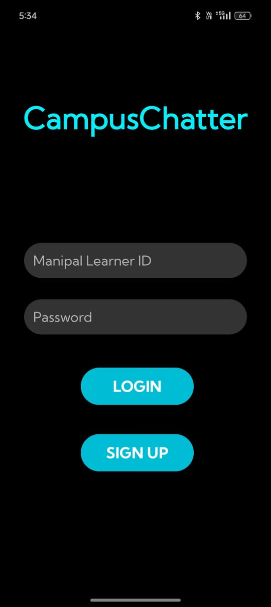
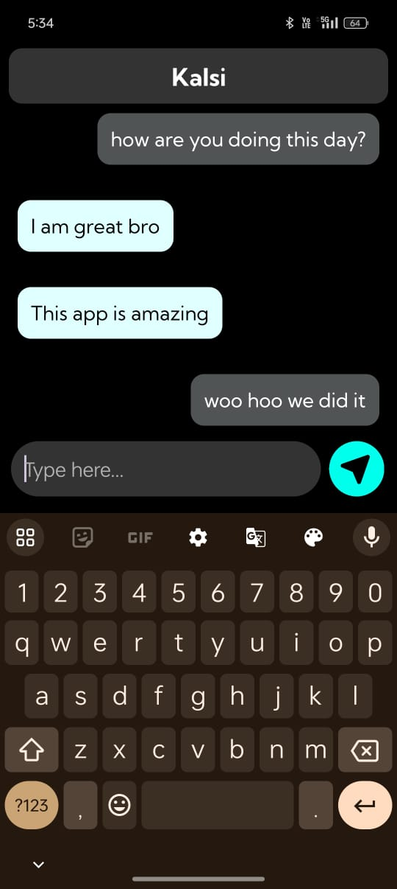
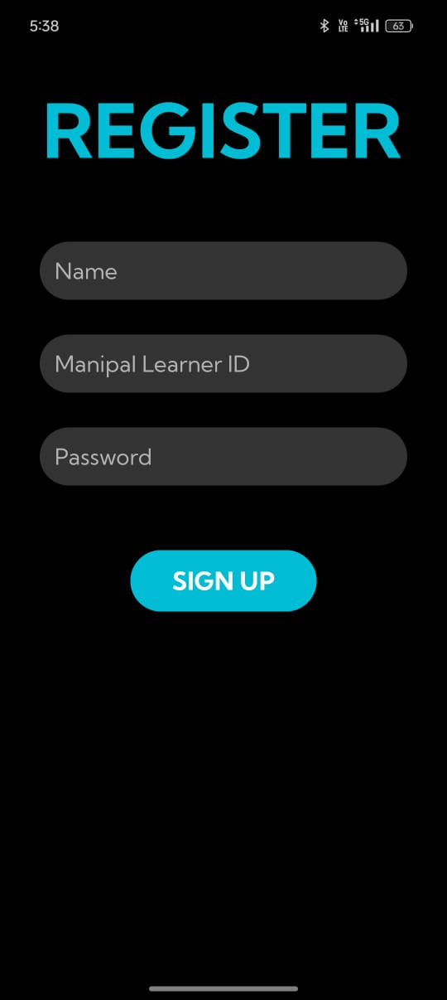

# CampusChatter

CampusChatter is a dedicated chatting application tailored for college campuses, ensuring secure and verified registration through college IDs verified via Firebase. Built using Kotlin, CampusChatter offers real-time chatting functionality along with user search capabilities.

## Features

- **College ID Verification**: Only users with valid college IDs can register, ensuring a secure and authentic community of college students.
- **Firebase Integration**: Seamless integration with Firebase for college ID verification and real-time chatting functionality.
- **Real-time Chatting**: Engage in instant messaging with fellow students, fostering collaboration and communication within the campus community.
- **User Search**: Easily find and connect with other users within the campus network.

## Screenshots






## Technologies Used

- **Kotlin**: The primary programming language used for building the application.
- **Firebase**: Used for authentication, real-time database, and storage functionalities.
- **Android SDK**: Leveraged for developing the Android application interface.

## Getting Started

To get started with CampusChatter, follow these steps:

1. Clone the repository:

   ```bash
   git clone https://github.com/yourusername/CampusChatter.git
